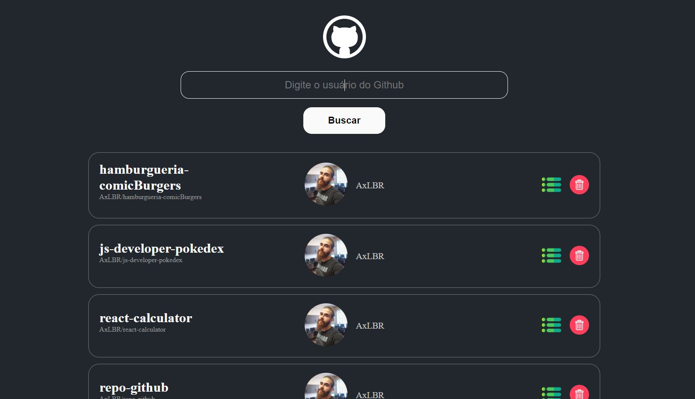

# Repositórios GitHub

Projeto desenvolvido como exercício do bootcamp Orange Tech+ da Dio, com intuíto de prática em ReactJS. O exercício proposto era implementar a função de remoção, e também melhorar a página do melhor jeito possível.

# Implementações
- Reestilização da página
- Pesquisa por usuários
- Exibição de todos repositórios públicos do usuário
- Caminho direto ao perfil do usuário
- Caminho até os repositórios específicos
- Função de remoção da lista de exibição
- Busca funcional com a tecla 'Enter'
- Tratamento de erros
- Responsividade

# Tecnologias utilizadas:
- HTML
- CSS
- JavaScript
- ReactJS
- Styled Components
- GitHub API
- Git/GitHub

[Clique aqui para acessar o projeto](https://axlbr.github.io/react-repo-github/)

# Contato
gabrieltoby@gmail.com
